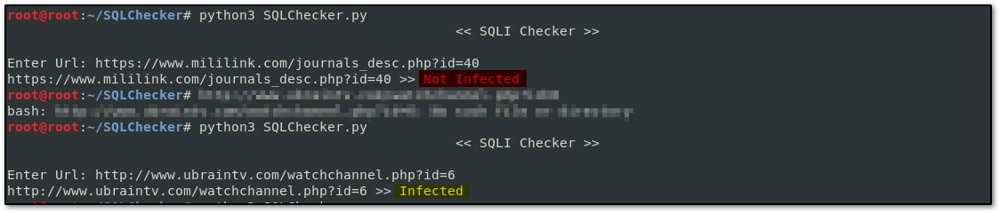

# SQLIChecker
- **A Tool Written In Python Add Very Simple Payload To The Site To Check If There Is SQL Error Or Not**
# Download And Run This Tool
```
git clone https://github.com/DEMON1A/SQLChecker
cd SQLChecker
python3 SQLIChecker.py
```
# Usage
- Just Enter The Website URL On First Input
# Requirements
> Python 3.x
# View

